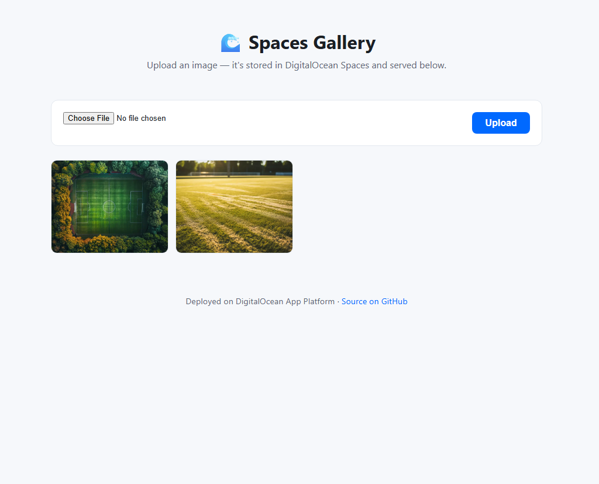

# 🌊 Spaces Gallery

A tiny image-upload gallery that stores files in **DigitalOcean Spaces** and runs on **DigitalOcean App Platform** — built to show how little it takes to ship a real app (web service + object storage) with no servers to manage and no Dockerfile to write.

> Part of [**oceanforge**](https://github.com/oceanforge) — small, deploy-it-yourself showcase apps for the DigitalOcean cloud.




## What it does

- Upload an image through a simple web form.
- The file is stored in a DigitalOcean Spaces bucket (S3-compatible object storage).
- Uploaded images are listed back in a responsive gallery, served straight from Spaces (or its CDN).

That's it — the point is the **deployment story**, not the feature list.

## Why it's a good App Platform demo

- **No Dockerfile.** App Platform detects the Python buildpack and builds it for you.
- **Two managed products, wired together.** A web service (this app) plus Spaces for storage.
- **Secrets, not hardcoding.** Spaces credentials are injected as encrypted App Platform environment variables.
- **Deploy on push.** Connect the repo once; every push to `main` redeploys.

## Run it locally

```bash
git clone https://github.com/oceanforge/spaces-gallery.git
cd spaces-gallery

python -m venv venv && source venv/bin/activate
pip install -r requirements.txt

cp .env.example .env   # then fill in your Spaces credentials
export $(grep -v '^#' .env | xargs)

python app.py
```

Open http://localhost:8080.

## Create a Spaces bucket

1. In the DigitalOcean control panel, go to **Spaces Object Storage → Create a Spaces Bucket**.
2. Choose a region (e.g. `nyc3`) and a unique bucket name.
3. Under **API → Spaces Keys**, generate an access key / secret pair.

Fill those into your `.env`:

```ini
SPACES_KEY=your-access-key
SPACES_SECRET=your-secret-key
SPACES_REGION=nyc3
SPACES_BUCKET=your-bucket-name
```

## Deploy to App Platform

The fastest path:

1. Fork this repo.
2. In DigitalOcean, go to **App Platform → Create App** and pick your fork.
3. App Platform detects the Python app automatically.
4. Add `SPACES_KEY`, `SPACES_SECRET`, `SPACES_REGION` and `SPACES_BUCKET` as **environment variables** (mark the key/secret as *encrypted*).
5. Click **Deploy**.

Prefer config-as-code? An app spec is included at [`.do/app.yaml`](.do/app.yaml).

## Configuration

| Variable | Required | Default | Description |
| --- | --- | --- | --- |
| `SPACES_KEY` | ✅ | — | Spaces access key |
| `SPACES_SECRET` | ✅ | — | Spaces secret key |
| `SPACES_BUCKET` | ✅ | — | Bucket name |
| `SPACES_REGION` | | `nyc3` | Spaces region |
| `SPACES_ENDPOINT` | | `https://<region>.digitaloceanspaces.com` | Origin endpoint |
| `SPACES_CDN_ENDPOINT` | | — | Optional CDN endpoint for faster delivery |
| `PORT` | | `8080` | Port the app listens on |

## Contributing

Issues and PRs welcome — see [CONTRIBUTING.md](CONTRIBUTING.md). Good first issues are labeled [`good first issue`](https://github.com/oceanforge/spaces-gallery/labels/good%20first%20issue).

This repo uses [pre-commit](https://pre-commit.com/) to run lint and formatting checks before each commit (the same checks CI enforces). Enable them once after cloning:

```bash
pip install pre-commit
pre-commit install
```

## License

[MIT](LICENSE)
